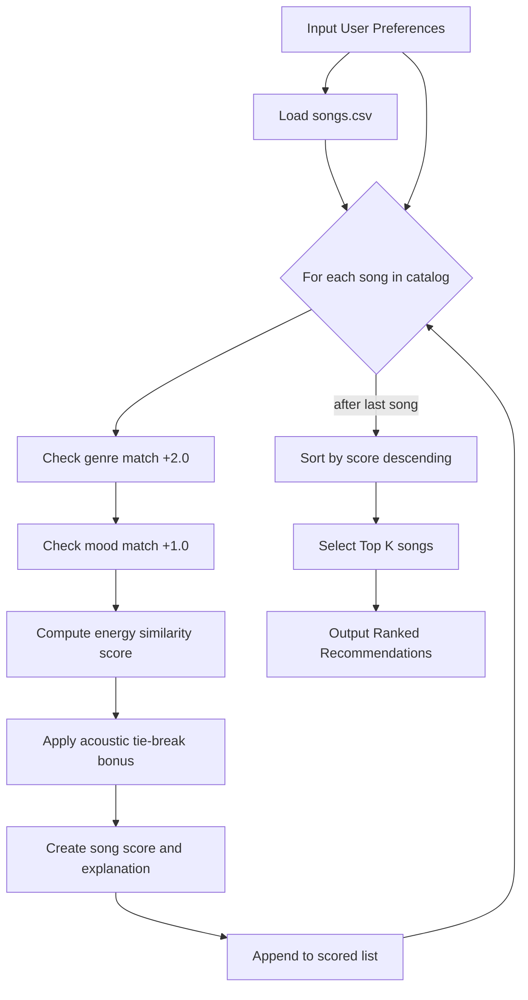
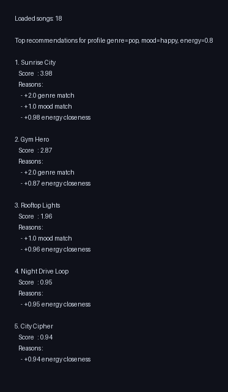
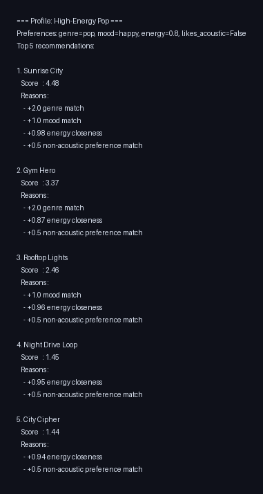
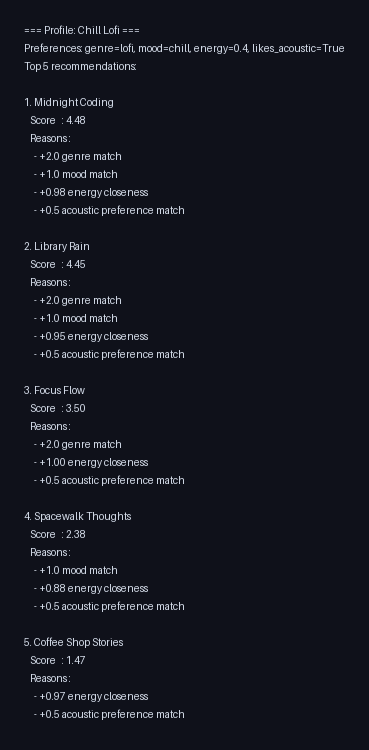
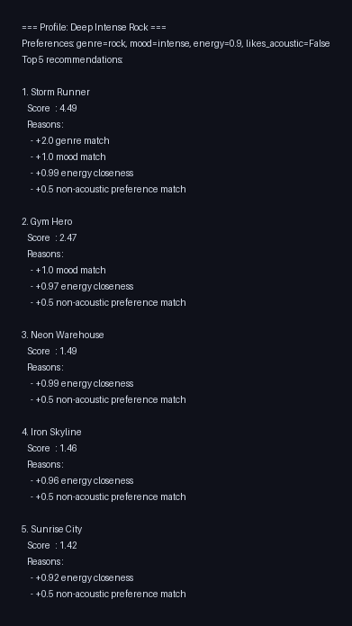
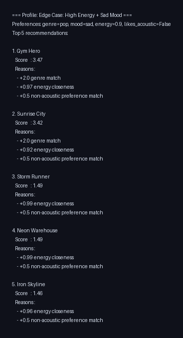
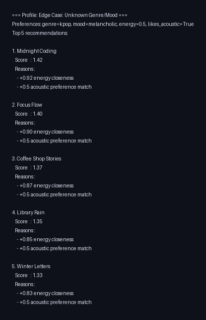

# 🎵 Music Recommender Simulation

## Project Summary

In this project you will build and explain a small music recommender system.

Your goal is to:

- Represent songs and a user "taste profile" as data
- Design a scoring rule that turns that data into recommendations
- Evaluate what your system gets right and wrong
- Reflect on how this mirrors real world AI recommenders

Replace this paragraph with your own summary of what your version does.

---

## How The System Works

Explain your design in plain language.

Some prompts to answer:

- What features does each `Song` use in your system
  - For example: genre, mood, energy, tempo
- What information does your `UserProfile` store
- How does your `Recommender` compute a score for each song
- How do you choose which songs to recommend

You can include a simple diagram or bullet list if helpful.

Real-world recommendation systems combine many signals (content, past behavior, context, and popularity) to estimate how likely a user is to enjoy each item, then rank results to balance relevance and variety. This simulation focuses on transparent content-based signals only: it priorities songs that match a user on genre and mood while rewarding songs whose energy is close to the user target, with acoustic preference used as an additional tie-break style signal.

### Plan Input to Process to Output

Input:
- User preferences: favorite genre, favorite mood, target energy, acoustic preference.
- Song catalog loaded from data/songs.csv.

Process:
- Iterate through each song in the catalog.
- Score each song with the same recipe.
- Store song, score, and explanation text.

Output:
- Sort all songs by score in descending order.
- Return the top k recommendations.

### Scoring Logic Design

Finalized Algorithm Recipe:
- Genre match: `+2.0` points if song genre equals the user's favorite genre.
- Mood match: `+1.0` points if song mood equals the user's favorite mood.
- Energy similarity: `+(1 - abs(song_energy - target_energy))` points, clipped to `[0.0, 1.0]`.
- Acoustic tie-break:
  - `+0.5` if user likes acoustic songs and `acousticness >= 0.60`
  - `+0.5` if user prefers non-acoustic songs and `acousticness <= 0.40`

Final score formula:

`score = genre_points + mood_points + energy_similarity + acoustic_bonus`

Ranking rule:
- Compute score for every song.
- Sort songs by descending score.
- Return top `k` songs.

Potential bias note:
- This system may over-prioritize genre, which can push down strong mood or energy matches from other genres.
- Because the catalog is small, recommendations also reflect dataset coverage and may under-serve niche tastes.

### Data Flow Map

Input:
- User preferences (`favorite_genre`, `favorite_mood`, `target_energy`, `likes_acoustic`)
- Song catalog from `data/songs.csv`

Process:
- Load all songs.
- Loop through songs one by one.
- For each song, compute score components:
  - genre points
  - mood points
  - energy similarity
  - acoustic tie-break bonus
- Store `(song, score, explanation)`.

Output:
- Sort all scored songs by score descending.
- Return top `k` recommendations.



Prompt to use in a new chat session named "Scoring Logic Design" (with `#file:songs.csv` attached):

"Using #file:songs.csv, help me tune a transparent scoring rule for a small music recommender. I currently use +2.0 for genre match, +1.0 for mood match, and up to +1.0 for energy closeness using 1 - abs(song_energy - target_energy). Suggest 2-3 alternative weight settings and explain tradeoffs (precision vs variety). Also recommend reasonable thresholds for an acousticness tie-break bonus and how large that bonus should be so it does not overpower genre/mood." 

Song features used in this simulation:
- `id`
- `title`
- `artist`
- `genre`
- `mood`
- `energy`
- `tempo_bpm`
- `valence`
- `danceability`
- `acousticness`

UserProfile features used in this simulation:
- `favorite_genre`
- `favorite_mood`
- `target_energy`
- `likes_acoustic`

### Phase 2 Designing the Simulation: Create a User Profile
taste_profile = {
  "favorite_genre": "lofi",
  "favorite_mood": "chill",
  "target_energy": 0.40,
  "likes_acoustic": True
}

---

## Getting Started

### Setup

1. Create a virtual environment (optional but recommended):

   ```bash
   python -m venv .venv
   source .venv/bin/activate      # Mac or Linux
   .venv\Scripts\activate         # Windows

2. Install dependencies

```bash
pip install -r requirements.txt
```

3. Run the app:

```bash
python -m src.main
```

### Running Tests

Run the starter tests with:

```bash
pytest
```

You can add more tests in `tests/test_recommender.py`.

### Terminal Output Screenshot

The image below shows the formatted recommendation output from running `python -m src.main` with the default profile (`pop` / `happy` / energy `0.8`).



### Stress Test with Diverse Profiles

Profiles evaluated in `src/main.py`:
- High-Energy Pop
- Chill Lofi
- Deep Intense Rock
- Edge Case: High Energy + Sad Mood
- Edge Case: Unknown Genre/Mood

Prompt for a new chat session named "System Evaluation" (with `#codebase` context):

"Using #codebase, suggest adversarial user preference profiles for this music recommender so I can stress-test scoring behavior. Include at least 3 edge cases with conflicting or unusual preferences (for example: very high energy + mood that does not exist in the catalog, unknown genre, or acoustic preference that conflicts with energy target). For each profile, explain what failure mode or bias it is testing and what outputs would look suspicious." 

Stress test screenshots:

#### High-Energy Pop


#### Chill Lofi


#### Deep Intense Rock


#### Edge Case: High Energy + Sad Mood


#### Edge Case: Unknown Genre/Mood


---

## Experiments You Tried

Use this section to document the experiments you ran. For example:

- What happened when you changed the weight on genre from 2.0 to 0.5
- What happened when you added tempo or valence to the score
- How did your system behave for different types of users

---

## Limitations and Risks

Summarize some limitations of your recommender.

Examples:

- It only works on a tiny catalog
- It does not understand lyrics or language
- It might over favor one genre or mood

You will go deeper on this in your model card.

---

## Reflection

Read and complete `model_card.md`:

[**Model Card**](model_card.md)

Write 1 to 2 paragraphs here about what you learned:

- about how recommenders turn data into predictions
- about where bias or unfairness could show up in systems like this


---

## 7. `model_card_template.md`

Combines reflection and model card framing from the Module 3 guidance. :contentReference[oaicite:2]{index=2}  

```markdown
# 🎧 Model Card - Music Recommender Simulation

## 1. Model Name

Give your recommender a name, for example:

> VibeFinder 1.0

---

## 2. Intended Use

- What is this system trying to do
- Who is it for

Example:

> This model suggests 3 to 5 songs from a small catalog based on a user's preferred genre, mood, and energy level. It is for classroom exploration only, not for real users.

---

## 3. How It Works (Short Explanation)

Describe your scoring logic in plain language.

- What features of each song does it consider
- What information about the user does it use
- How does it turn those into a number

Try to avoid code in this section, treat it like an explanation to a non programmer.

---

## 4. Data

Describe your dataset.

- How many songs are in `data/songs.csv`
- Did you add or remove any songs
- What kinds of genres or moods are represented
- Whose taste does this data mostly reflect

---

## 5. Strengths

Where does your recommender work well

You can think about:
- Situations where the top results "felt right"
- Particular user profiles it served well
- Simplicity or transparency benefits

---

## 6. Limitations and Bias

Where does your recommender struggle

Some prompts:
- Does it ignore some genres or moods
- Does it treat all users as if they have the same taste shape
- Is it biased toward high energy or one genre by default
- How could this be unfair if used in a real product

---

## 7. Evaluation

How did you check your system

Examples:
- You tried multiple user profiles and wrote down whether the results matched your expectations
- You compared your simulation to what a real app like Spotify or YouTube tends to recommend
- You wrote tests for your scoring logic

You do not need a numeric metric, but if you used one, explain what it measures.

---

## 8. Future Work

If you had more time, how would you improve this recommender

Examples:

- Add support for multiple users and "group vibe" recommendations
- Balance diversity of songs instead of always picking the closest match
- Use more features, like tempo ranges or lyric themes

---

## 9. Personal Reflection

A few sentences about what you learned:

- What surprised you about how your system behaved
- How did building this change how you think about real music recommenders
- Where do you think human judgment still matters, even if the model seems "smart"

